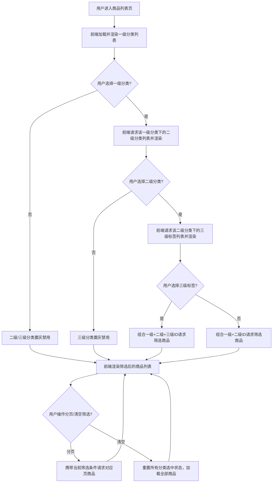

# 足球俱乐部球衣三级分类筛选功能设计文档
## 一、需求核心确认
你需要为足球俱乐部球衣商品设计**三级联动分类筛选功能**，核心层级定义如下：
- 一级分类：联赛维度（如 Brasileiro Série A、Premier League、Serie A 等）；
- 二级分类：俱乐部维度（隶属于一级联赛，如 Flamengo、佛罗伦萨等）；
- 三级分类：属性标签维度（隶属于二级俱乐部，如“复古的”“主场”“客场”等）；
最终需实现“选择一级联动加载二级、选择二级联动加载三级、组合条件筛选商品”的完整功能，且内容需适配 MD 文档格式。

## 二、业务逻辑梳理
### 1. 核心业务规则
| 规则维度         | 具体说明                                                                 |
|------------------|--------------------------------------------------------------------------|
| 层级联动规则     | 一级分类决定二级分类的可选范围，二级分类决定三级标签的可选范围，层级不可跨选； |
| 筛选组合规则     | 支持“仅一级”“一级+二级”“一级+二级+三级”三种筛选组合，也可清空所有筛选；     |
| 数据状态规则     | 分类/标签需包含“启用/禁用”状态，禁用的分类不展示、不参与筛选；               |
| 数据一致性规则   | 商品必须关联有效的“一级+二级+三级”分类ID，避免脏数据导致筛选异常；           |

### 2. 核心业务流程（用户侧）


## 三、程序设计思路
### 1. 数据模型设计（后端）
#### （1）一级分类表（联赛表）：`league_category`
| 字段名         | 字段类型   | 说明                     | 示例值               |
|----------------|------------|--------------------------|----------------------|
| id             | int        | 主键（自增）| 1                    |
| name           | varchar    | 联赛名称（多语言适配）| Brasileiro Série A  |
| code           | varchar    | 联赛唯一编码             | BRA_SERIE_A         |
| sort           | int        | 排序权重（数字越小越靠前） | 10                   |
| is_enabled     | tinyint    | 是否启用（1=启用/0=禁用） | 1                    |
| create_time    | datetime   | 创建时间                 | 2026-02-05 10:00:00  |
| update_time    | datetime   | 更新时间                 | 2026-02-05 10:00:00  |

#### （2）二级分类表（俱乐部表）：`club_category`
| 字段名         | 字段类型   | 说明                     | 示例值               |
|----------------|------------|--------------------------|----------------------|
| id             | int        | 主键（自增）| 9                    |
| league_id      | int        | 关联一级分类ID           | 1                    |
| name           | varchar    | 俱乐部名称（多语言）| Flamengo             |
| code           | varchar    | 俱乐部唯一编码           | BRA_FLA              |
| sort           | int        | 排序权重                 | 9                    |
| is_enabled     | tinyint    | 是否启用                 | 1                    |
| create_time    | datetime   | 创建时间                 | 2026-02-05 10:00:00  |
| update_time    | datetime   | 更新时间                 | 2026-02-05 10:00:00  |

#### （3）三级标签表：`tag_category`
| 字段名         | 字段类型   | 说明                     | 示例值               |
|----------------|------------|--------------------------|----------------------|
| id             | int        | 主键（自增）| 1001                 |
| club_id        | int        | 关联二级分类ID           | 9                    |
| name           | varchar    | 标签名称（多语言）| 复古的               |
| sort           | int        | 排序权重                 | 1                    |
| is_enabled     | tinyint    | 是否启用                 | 1                    |
| create_time    | datetime   | 创建时间                 | 2026-02-05 10:00:00  |
| update_time    | datetime   | 更新时间                 | 2026-02-05 10:00:00  |

#### （4）商品-分类关联表：`product_category_relation`
| 字段名         | 字段类型   | 说明                     | 示例值               |
|----------------|------------|--------------------------|----------------------|
| id             | int        | 主键（自增）| 1                    |
| product_id     | int        | 商品ID                   | 10001                |
| league_id      | int        | 一级分类ID               | 1                    |
| club_id        | int        | 二级分类ID               | 9                    |
| tag_id         | int        | 三级标签ID               | 1001                 |
| create_time    | datetime   | 创建时间                 | 2026-02-05 10:00:00  |

### 2. 后端接口设计（RESTful 风格）
#### （1）查询一级分类列表
- 接口路径：`/api/v1/league-category`
- 请求方式：GET
- 请求参数：`is_enabled`（可选，默认1）、`sort`（可选，默认asc）
- 响应示例：
```json
{
  "code": 200,
  "msg": "success",
  "data": [
    {
      "id": 1,
      "name": "Brasileiro Série A",
      "code": "BRA_SERIE_A",
      "sort": 10
    },
    {
      "id": 2,
      "name": "Premier League",
      "code": "ENG_PREMIER",
      "sort": 20
    }
  ]
}
```

#### （2）根据一级分类ID查询二级分类列表
- 接口路径：`/api/v1/club-category`
- 请求方式：GET
- 请求参数：`league_id`（必选）、`is_enabled`（可选，默认1）、`sort`（可选，默认asc）
- 响应示例：
```json
{
  "code": 200,
  "msg": "success",
  "data": [
    {
      "id": 9,
      "league_id": 1,
      "name": "Flamengo",
      "code": "BRA_FLA",
      "sort": 9
    },
    {
      "id": 10,
      "league_id": 1,
      "name": "Palmeiras",
      "code": "BRA_PAL",
      "sort": 10
    }
  ]
}
```

#### （3）根据二级分类ID查询三级标签列表
- 接口路径：`/api/v1/tag-category`
- 请求方式：GET
- 请求参数：`club_id`（必选）、`is_enabled`（可选，默认1）、`sort`（可选，默认asc）
- 响应示例：
```json
{
  "code": 200,
  "msg": "success",
  "data": [
    {
      "id": 1001,
      "club_id": 9,
      "name": "复古的",
      "sort": 1
    },
    {
      "id": 1002,
      "club_id": 9,
      "name": "主场",
      "sort": 2
    }
  ]
}
```

#### （4）组合条件筛选商品
- 接口路径：`/api/v1/product/filter`
- 请求方式：GET
- 请求参数：`league_id`（可选）、`club_id`（可选）、`tag_id`（可选）、`page`（可选，默认1）、`size`（可选，默认20）
- 响应示例：
```json
{
  "code": 200,
  "msg": "success",
  "data": {
    "list": [
      {
        "id": 10001,
        "name": "1994年复古佛罗伦萨白衣",
        "price": "10.00 - 11.00 美元",
        "image": "https://xxx.jpg",
        "league_id": 4,
        "club_id": 120,
        "tag_id": 1001
      }
    ],
    "total": 100,
    "page": 1,
    "size": 20
  }
}
```

### 3. 前端实现思路（Vue3 + Element Plus）
#### （1）组件结构（模板层）
```vue
<template>
  <div class="category-filter-container">
    <!-- 三级分类筛选下拉框 -->
    <div class="filter-select-group">
      <!-- 一级分类：联赛 -->
      <el-select
        v-model="leagueId"
        placeholder="请选择联赛"
        @change="handleLeagueChange"
        clearable
      >
        <el-option
          v-for="item in leagueList"
          :key="item.id"
          :label="item.name"
          :value="item.id"
        />
      </el-select>

      <!-- 二级分类：俱乐部（依赖一级分类） -->
      <el-select
        v-model="clubId"
        placeholder="请选择俱乐部"
        @change="handleClubChange"
        :disabled="!leagueId"
        clearable
      >
        <el-option
          v-for="item in clubList"
          :key="item.id"
          :label="item.name"
          :value="item.id"
        />
      </el-select>

      <!-- 三级分类：标签（依赖二级分类） -->
      <el-select
        v-model="tagId"
        placeholder="请选择标签"
        @change="handleTagChange"
        :disabled="!clubId"
        clearable
      >
        <el-option
          v-for="item in tagList"
          :key="item.id"
          :label="item.name"
          :value="item.id"
        />
      </el-select>

      <!-- 清空筛选按钮 -->
      <el-button type="primary" @click="handleClearFilter">清空筛选</el-button>
    </div>

    <!-- 商品列表 -->
    <div class="product-list">
      <div v-for="item in productList" :key="item.id" class="product-item">
        
        <div class="product-name">{{ item.name }}</div>
        <div class="product-price">{{ item.price }}</div>
      </div>
    </div>

    <!-- 分页组件 -->
    <el-pagination
      v-model:current-page="page"
      v-model:page-size="size"
      :total="total"
      @size-change="handleSizeChange"
      @current-change="handleCurrentChange"
      layout="prev, pager, next, jumper, ->, total, sizes"
    />
  </div>
</template>
```

#### （2）逻辑层（Script Setup）
```javascript
import { ref, onMounted } from 'vue';
import { ElMessage } from 'element-plus';
// 导入API请求函数
import { getLeagueList, getClubList, getTagList, getProductList } from '@/api/category';

// 1. 响应式数据定义
const leagueId = ref(''); // 选中的一级分类ID
const clubId = ref('');   // 选中的二级分类ID
const tagId = ref('');    // 选中的三级标签ID
const leagueList = ref([]); // 一级分类列表
const clubList = ref([]);   // 二级分类列表
const tagList = ref([]);    // 三级标签列表
const productList = ref([]); // 筛选后的商品列表
const page = ref(1);         // 当前页码
const size = ref(20);        // 每页条数
const total = ref(0);        // 商品总数
const loading = ref(false);  // 加载状态

// 2. 初始化：加载一级分类
onMounted(async () => {
  await loadLeagueData();
});

// 3. 分类联动方法
// 加载一级分类数据
const loadLeagueData = async () => {
  try {
    loading.value = true;
    const res = await getLeagueList({ is_enabled: 1 });
    if (res.code === 200) {
      leagueList.value = res.data;
    } else {
      ElMessage.error('加载联赛列表失败');
    }
  } catch (err) {
    ElMessage.error('网络异常，请重试');
  } finally {
    loading.value = false;
  }
};

// 一级分类变更：加载二级分类
const handleLeagueChange = async (val) => {
  // 清空下级选中状态和列表，避免数据残留
  clubId.value = '';
  tagId.value = '';
  clubList.value = [];
  tagList.value = [];
  
  if (val) {
    try {
      loading.value = true;
      const res = await getClubList({ league_id: val, is_enabled: 1 });
      if (res.code === 200) {
        clubList.value = res.data;
      } else {
        ElMessage.error('加载俱乐部列表失败');
      }
    } catch (err) {
      ElMessage.error('网络异常，请重试');
    } finally {
      loading.value = false;
    }
  }
  // 触发商品筛选
  await loadProductData();
};

// 二级分类变更：加载三级标签
const handleClubChange = async (val) => {
  // 清空三级选中状态和列表
  tagId.value = '';
  tagList.value = [];
  
  if (val) {
    try {
      loading.value = true;
      const res = await getTagList({ club_id: val, is_enabled: 1 });
      if (res.code === 200) {
        tagList.value = res.data;
      } else {
        ElMessage.error('加载标签列表失败');
      }
    } catch (err) {
      ElMessage.error('网络异常，请重试');
    } finally {
      loading.value = false;
    }
  }
  // 触发商品筛选
  await loadProductData();
};

// 三级标签变更：直接筛选商品
const handleTagChange = async () => {
  await loadProductData();
};

// 4. 商品筛选核心方法
const loadProductData = async () => {
  try {
    loading.value = true;
    // 组装筛选参数
    const params = {
      league_id: leagueId.value,
      club_id: clubId.value,
      tag_id: tagId.value,
      page: page.value,
      size: size.value
    };
    const res = await getProductList(params);
    if (res.code === 200) {
      productList.value = res.data.list;
      total.value = res.data.total;
    } else {
      ElMessage.error('加载商品列表失败');
    }
  } catch (err) {
    ElMessage.error('网络异常，请重试');
  } finally {
    loading.value = false;
  }
};

// 5. 分页/清空操作
// 清空所有筛选条件
const handleClearFilter = async () => {
  leagueId.value = '';
  clubId.value = '';
  tagId.value = '';
  clubList.value = [];
  tagList.value = [];
  page.value = 1;
  await loadProductData();
};

// 分页-每页条数变更
const handleSizeChange = async (val) => {
  size.value = val;
  await loadProductData();
};

// 分页-当前页变更
const handleCurrentChange = async (val) => {
  page.value = val;
  await loadProductData();
};
```

#### （3）API 封装层（/src/api/category.js）
```javascript
import request from '@/utils/request';

/**
 * 查询一级分类（联赛）列表
 * @param {Object} params - { is_enabled, sort }
 * @returns {Promise}
 */
export const getLeagueList = (params) => {
  return request({
    url: '/api/v1/league-category',
    method: 'get',
    params
  });
};

/**
 * 根据联赛ID查询二级分类（俱乐部）列表
 * @param {Object} params - { league_id, is_enabled, sort }
 * @returns {Promise}
 */
export const getClubList = (params) => {
  return request({
    url: '/api/v1/club-category',
    method: 'get',
    params
  });
};

/**
 * 根据俱乐部ID查询三级标签列表
 * @param {Object} params - { club_id, is_enabled, sort }
 * @returns {Promise}
 */
export const getTagList = (params) => {
  return request({
    url: '/api/v1/tag-category',
    method: 'get',
    params
  });
};

/**
 * 组合分类条件筛选商品
 * @param {Object} params - { league_id, club_id, tag_id, page, size }
 * @returns {Promise}
 */
export const getProductList = (params) => {
  return request({
    url: '/api/v1/product/filter',
    method: 'get',
    params
  });
};
```

### 4. 性能与扩展性优化
| 优化维度       | 具体措施                                                                 |
|----------------|--------------------------------------------------------------------------|
| 后端性能       | 1. 为分类表的关联字段（league_id/club_id）、状态字段（is_enabled）建立索引；<br>2. 用Redis缓存分类列表（缓存时效1小时，分类变更时主动更新）； |
| 前端性能       | 1. 分类列表做本地缓存（sessionStorage），页面刷新无需重复请求；<br>2. 商品列表支持图片懒加载；<br>3. 接口请求增加loading状态，防止重复请求； |
| 功能扩展性     | 1. 分类表预留`code`字段，支持多语言、第三方系统对接；<br>2. 三级标签支持多标签筛选（将tag_id改为数组，后端用IN查询）； |
| 异常处理       | 1. 前端捕获所有接口异常，给出友好提示；<br>2. 后端校验分类ID合法性，避免无效参数查询； |

## 四、总结
### 核心关键点回顾
1. **层级联动核心**：一级分类决定二级、二级决定三级，切换上层分类时必须清空下层选中状态和列表，保证数据一致性；
2. **数据模型核心**：通过4张核心表（联赛/俱乐部/标签/商品关联）实现分类与商品的解耦，便于后续维护；
3. **性能与体验核心**：后端加索引+缓存提升查询效率，前端加loading+异常提示+本地缓存提升用户体验；

该设计既满足“三级联动筛选”的核心需求，又兼顾了性能、扩展性和用户体验，代码结构清晰、逻辑闭环，可直接适配MD文档落地开发。